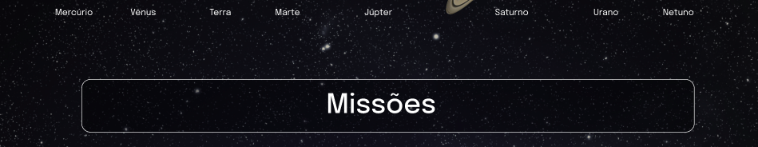

# Boas-vindas ao repositório do projeto Solar System!

<details>
  <summary><strong>👨‍💻 O que foi desenvolvido</strong></summary><br />

    * Visualizar todos os planetas do sistema solar renderizados na tela;

    * Visualizar todas as cartas com informações sobre missões espaciais;

</details>

<details>
  <summary><strong>:memo: Habilidades</strong></summary><br />

  * Utilizar JSX no React;

  * Utilizar corretamente o método `render()` para renderizar seus componentes;

  * Utilizar `import` para trazer componentes em diferentes arquivos;

  * Criar componentes de classe em React;

  * Criar múltiplos componentes a partir de um array;

  * Fazer uso de `props` corretamente;

  * Fazer uso de `PropTypes` para validar as `props de um componente`.
</details>

# Orientações

<details>
  <summary><strong>‼️ Como executar</strong></summary><br />

  1. Clone o repositório

  - Use o comando: `git clone git@github.com:brandao-rafael/solar-system.git`.
  - Entre na pasta do repositório que você acabou de clonar:
    - `cd sd-023-a-project-solar-system`

  2. Instale as dependências

  - `npm install`.
  
  3. Inicie a aplicação
  - `npm start`

</details>

# Requisitos

## 1. Crie um componente chamado `Header`

<details>
  <summary>Crie um componente chamado <code>Header</code> dentro da pasta <code>src/components</code>. Este componente irá renderizar o título principal da página.</summary>

  - Ele deve conter uma tag `header` e, dentro dela, uma tag `h1`. O texto da tag `h1` deve ser "Sistema Solar";
    
  - Renderize o componente `Header` dentro do componente principal `App`.

  
</details>

---

## 2. Crie um componente chamado `SolarSystem`

<details>
  <summary>Crie um componente chamado <code>SolarSystem</code> dentro da pasta <code>src/components</code>.</summary>

  - O componente `SolarSystem` deve ter uma `div` que envolva todo seu conteúdo e que tenha o atributo `data-testid="solar-system"`;

  - Renderize o componente `SolarSystem` abaixo do `Header`, dentro do componente principal `App`.
</details>

---

## 3. Crie um componente chamado `Title`

<details>
  <summary>Crie um componente chamado <code>Title</code> dentro da pasta <code>src/components</code>.</summary>

  - O componente `Title` deve receber uma prop `headline`;
    
  - Ele deve conter uma tag `h2`, que deve renderizar o texto recebido pela prop `headline`.
</details>

---

## 4. Renderize o componente `Title` dentro do componente `SolarSystem`

<details>
  <summary>Renderize o componente <code>Title</code> dentro do componente <code>SolarSystem</code>.</summary>

  - O componente `Title` deve ser renderizado recebendo a prop `headline` com o valor "Planetas".

  
</details>

---

## 5. Crie um componente chamado `PlanetCard`
<details>
  <summary>Crie um componente chamado <code>PlanetCard</code> dentro da pasta <code>src/components</code>.</summary>

  - O componente `PlanetCard` deve receber duas props: uma chamada `planetName` e outra chamada `planetImage`;
    
  - O componente `PlanetCard` deve ter uma `div` que envolva todo seu conteúdo e que tenha o atributo `data-testid="planet-card"`;
    
  - O componente `PlanetCard` deve renderizar o texto recebido pela prop `planetName`. Sugerimos a utilização de tags de [Conteúdo de Fluxo](https://developer.mozilla.org/pt-BR/docs/Web/Guide/HTML/Content_categories#conte%C3%BAdo_de_fluxo), como `<p>`, que deve conter o atributo `data-testid="planet-name"`;
    
  - O componente `PlanetCard` deve renderizar uma imagem que tenha o atributo `src` com o valor recebido pela prop `planetImage`;

  - Além do atributo `src`, a imagem renderizada deve ter o atributo `alt` com o texto `Planeta {planetName}`, onde `{planetName}` é o valor recebido pela prop `planetName`.
</details>

---

## 6. Renderize uma lista com os planetas do Sistema Solar

<details>
  <summary>Renderize uma lista com os planetas do Sistema Solar dentro do componente <code>SolarSystem</code>.</summary>

  - Utilize o componente `PlanetCard` para renderizar cada item da lista de planetas;

  - Você encontrará a lista com os nomes e as imagens de cada planeta do Sistema Solar no arquivo `src/data/planets.js`;
    
  - Você deve importar a lista no componente `SolarSystem` usando o código:
  ```javascript
  import planets from '../data/planets';
  ```

  - A lista de planetas é um _array_ de objetos no seguinte formato:
  ```javascript
  {
    name: "Nome do planeta",
    image: "caminho-para-imagem-do-planeta"
  }
  ```

  - Para cada planeta da lista, você deverá renderizar um componente `PlanetCard`, passando o atributo `name` para a prop `planetName` e o atributo `image` para a prop `planetImage`.

  
</details>

---

## 7. Crie um componente chamado `Missions`.

<details>
  <summary>Crie um componente chamado <code>Missions</code> dentro da pasta <code>src/components</code>.</summary>

  - Este componente deve ter uma `div` que envolva todo seu conteúdo e que tenha o atributo `data-testid="missions"`;

  - Renderize o componente `Missions` abaixo do `SolarSystem`, dentro do componente principal `App`.
</details>

---

## 8. Renderize o componente `Title` dentro do componente `Missions`.

<details>
  <summary>Renderize o componente <code>Title</code> dentro do componente <code>Missions</code>.</summary>

  - O componente `Title` deve ser renderizado recebendo a prop `headline` com o valor "Missões".

  
</details>

---

## 9. Crie um componente chamado `MissionCard`.

<details>
  <summary>Crie um componente chamado <code>MissionCard</code> dentro da pasta <code>src/components</code>.</summary>

  - O componente `MissionCard` deve receber quatro props:
    - `name`
    - `year`
    - `country`
    - `destination`

  - O componente `MissionCard` deve ter uma `div` que envolva todo seu conteúdo e que tenha o atributo `data-testid="mission-card"`;
  
  - O componente `MissionCard` deve renderizar o texto recebido pela prop `name`. Sugerimos a utilização de tags de [Conteúdo de Fluxo](https://developer.mozilla.org/pt-BR/docs/Web/Guide/HTML/Content_categories#conte%C3%BAdo_de_fluxo), como `<p>`, que deve conter o atributo `data-testid="mission-name"`;
  
  - O componente `MissionCard` deve renderizar o texto recebido pela prop `year`. Sugerimos a utilização de tags de [Conteúdo de Fluxo](https://developer.mozilla.org/pt-BR/docs/Web/Guide/HTML/Content_categories#conte%C3%BAdo_de_fluxo), como `<p>`, que deve conter o atributo `data-testid="mission-year"`;
  
  - O componente `MissionCard` deve renderizar o texto recebido pela prop `country`. Sugerimos a utilização de tags de [Conteúdo de Fluxo](https://developer.mozilla.org/pt-BR/docs/Web/Guide/HTML/Content_categories#conte%C3%BAdo_de_fluxo), como `<p>`, que deve conter o atributo `data-testid="mission-country"`;
  
  - O componente `MissionCard` deve renderizar o texto recebido pela prop `destination`. Sugerimos a utilização de tags de [Conteúdo de Fluxo](https://developer.mozilla.org/pt-BR/docs/Web/Guide/HTML/Content_categories#conte%C3%BAdo_de_fluxo), como `<p>`, que deve conter o atributo `data-testid="mission-destination"`.
</details>

---

## 10. Renderize uma lista com as missões espaciais

<details>
  <summary>Renderize uma lista com as missões espaciais dentro do componente <code>Missions</code>.</summary>

  - Utilize o componente `MissionCard` para renderizar cada item da lista de missões;

  - Você encontrará a lista com as informações de cada missão espacial no arquivo `src/data/missions.js`;

  - Você deve importar a lista no componente `Missions` usando o código:
  ```javascript
  import missions from '../data/missions';
  ```

  - A lista de missões espaciais é um _array_ de objetos no seguinte formato:
  ```javascript
  {
    name: 'Nome da missão',
    year: 'Ano de lançamento da missão',
    country: 'País que lançou a missão',
    destination: 'Destino da missão',
  }
  ```

  - Para cada missão espacial da lista, você deverá renderizar um componente `MissionCard`, passando cada atributo para sua respectiva prop.

  
</details>

---
